# Trabajo Final Integrador — Ingeniería de Software III

## Solución a problemas de diseño usando UML y Patrones de Diseño

**Licenciatura en Sistemas de Información — Universidad de Champagnat (UCH)**

| | |
|---|---|
| **Integrantes (Grupo D)** | Gregorio Luján, Manuel Moya, Jan Lahorca, Agustín Martínez |
| **Docente** | Lic. Marcelo Palma |
| **Fecha** | 22/06/2026 |
| **Proyecto** | CaféExpress — Sistema de pedidos de cafetería |
| **Repositorio** | https://github.com/lujangrego99/cafe-express-isw3 |

---

## 1. Resultados de aprendizaje a los que aporta

Comprender los conceptos y fundamentos de los patrones de diseño de software, incluyendo el problema, solución y consecuencia, considerando catálogos, reconociendo clasificaciones, identificando criterios de selección y uso, interacción humano-computadora y diseño centrado en el usuario para su aplicación en el diseño e implementación de software eficiente y fácil de usar.

## 2. Objetivo

Integrar patrones de diseño y consideraciones de UX-UI-DCU-HCI en una solución de software completa (full-stack) para resolver una necesidad de complejidad media. La solución elegida es **CaféExpress**, un módulo de gestión de pedidos para una cafetería, que en el backend aplica **cuatro patrones GOF** (Decorator, State, Strategy y Observer) y en el frontend aplica los principios de Diseño Centrado en el Usuario vistos en la materia.

## 3. Introducción al problema

Una cafetería necesita digitalizar la toma de pedidos del mostrador y su seguimiento en cocina. El problema tiene dos caras que justifican una solución full-stack:

- **Lado cliente (mostrador):** armar una bebida es altamente combinatorio. Una base (espresso, latte, etc.) puede llevar cualquier combinación de adicionales (shot extra, crema, leche vegetal…), y el precio debe recalcularse al instante. Además se aplican promociones que cambian (estudiante, happy hour, canje de puntos).
- **Lado operación (cocina):** cada pedido recorre un ciclo de vida (pendiente → en preparación → listo → entregado, o cancelado) con reglas estrictas sobre qué transición es válida. Varias "pantallas" distintas deben enterarse de cada cambio: el tablero de cocina, el aviso al cliente y un panel de estadísticas.

Estas necesidades mapean naturalmente a cuatro patrones GOF, lo que convierte al dominio en un buen caso integrador.

## 4. Análisis

### 4.1 Datos de entrada, procesos y resultados

| Datos de entrada | Procesos | Resultados esperados |
|---|---|---|
| Bebida base + adicionales elegidos | Composición de la bebida (Decorator) y cálculo de costo | Precio unitario y descripción detallada de cada ítem |
| Tipo de descuento + puntos | Cálculo de descuento (Strategy) sobre el subtotal | Total final del pedido |
| Acción del barista (preparar/listo/entregar/cancelar) | Validación y cambio de estado (State) | Pedido en su nuevo estado o error de transición |
| Cambio de estado de un pedido | Notificación (Observer) | Tablero de cocina, avisos y estadísticas actualizados |

### 4.2 Análisis descendente (Top-Down)

El problema se descompone por refinamientos sucesivos:

1. **CaféExpress** (sistema)
   1. **Catálogo** — qué bebidas, adicionales y descuentos se ofrecen.
   2. **Armado de pedido** — composición de bebidas y carrito.
      1. Bebida = base + N adicionales → *Decorator*.
      2. Total = subtotal − descuento → *Strategy*.
   3. **Gestión del pedido** — ciclo de vida.
      1. Transiciones válidas según estado → *State*.
      2. Difusión de cada cambio a múltiples interesados → *Observer*.
   4. **Interfaz de usuario** — mostrador (cliente) y cocina (barista).

### 4.3 Análisis de usuarios (DCU)

| Perfil | Objetivo | Necesidad de diseño |
|---|---|---|
| **Cliente en el mostrador** | Pedir su café personalizado rápido | Menú visual, personalización clara, total siempre visible |
| **Barista / cocina** | Ver qué preparar y avanzar el pedido | Tablero tipo comanda, acciones grandes, estado evidente |
| **Encargado** | Controlar la operación | Panel de notificaciones y estadísticas en tiempo real |

### 4.4 Arquitectura de la información

La aplicación se organiza en dos secciones de alto nivel, accesibles desde una barra de navegación persistente:

- **Mostrador:** *Menú* (grilla de bebidas) → *Personalizar* (modal de adicionales) → *Carrito* (ítems, descuento, total) → *Confirmar*.
- **Cocina:** *Comandas activas* (tickets con acciones) + *Panel* (notificaciones y estadísticas).

## 5. Arquitectura general de la solución

CaféExpress es una aplicación **full-stack**: un backend REST en **Java + Spring Boot** y un frontend **SPA en JavaScript (Vue 3)** que lo consume. El backend concentra la lógica de dominio y los cuatro patrones; el frontend se ocupa de la experiencia de usuario.

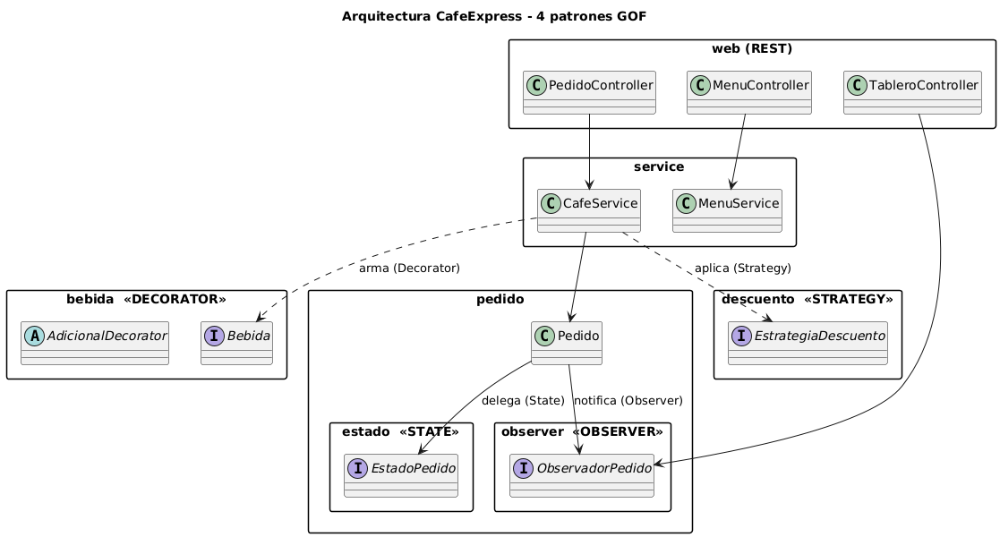

Los cuatro patrones no viven aislados: se entrelazan en la entidad `Pedido`, que es **Context** de State, **Subject** de Observer y receptor del resultado de Strategy, y que contiene ítems construidos con Decorator.

---

## 6. Patrones de diseño GOF aplicados

> Por cada patrón se documenta: **Nombre**, **Propósito**, **Motivación**, **Estructura** (diagrama de clases), **Participantes** (responsabilidades) y **Colaboración** (diagrama de interacción).

### 6.1 Patrón Decorator

**Nombre.** Decorator (patrón estructural, GOF).

**Propósito.** Asignar responsabilidades adicionales a un objeto de forma dinámica. Es una alternativa flexible a la herencia para extender funcionalidad.

**Motivación.** Una bebida puede llevar cualquier combinación de adicionales. Resolverlo con herencia provocaría una explosión de clases (`LatteConShot`, `LatteConShotYCrema`, …). Con Decorator, cada adicional es un objeto que **envuelve** a la bebida y le suma su costo y descripción; los adicionales se apilan en cualquier orden y cantidad. El cliente trata igual a una bebida simple y a una decorada porque ambas implementan `Bebida`.

**Estructura.**

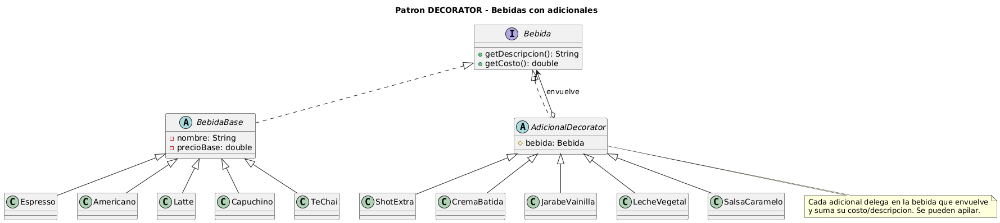

**Participantes.**

| Participante | Rol GOF | Responsabilidad |
|---|---|---|
| `Bebida` | Component | Interfaz común: `getDescripcion()`, `getCosto()` |
| `BebidaBase` y subclases (`Espresso`, `Latte`, …) | ConcreteComponent | Bebida sin adicionales, con su precio base |
| `AdicionalDecorator` | Decorator (abstracto) | Mantiene la referencia a la `Bebida` envuelta y delega en ella |
| `ShotExtra`, `CremaBatida`, … | ConcreteDecorator | Agregan su costo y texto al resultado de la bebida envuelta |
| `BebidaFactory` | Auxiliar | Arma la pila de decorators a partir de los ids del menú |

**Colaboración.** Al pedir el costo de "Latte + Shot + Vainilla", cada decorator delega en el que envuelve y suma su parte:

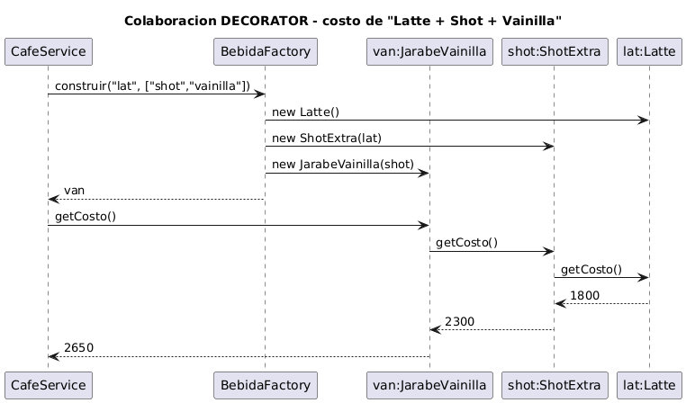

### 6.2 Patrón State

**Nombre.** State (patrón de comportamiento, GOF).

**Propósito.** Permitir que un objeto altere su comportamiento cuando cambia su estado interno; el objeto parece cambiar de clase.

**Motivación.** Un pedido reacciona distinto a la misma acción según su estado: "entregar" es válido si está *Listo* pero inválido si está *Pendiente*. Resolverlo con `if/switch` regados por cada operación es frágil. Con State, cada estado es una clase que sabe qué transiciones permite; agregar un estado nuevo (p. ej. *En reparto*) es crear una clase, sin tocar las demás (Open/Closed).

**Estructura.**

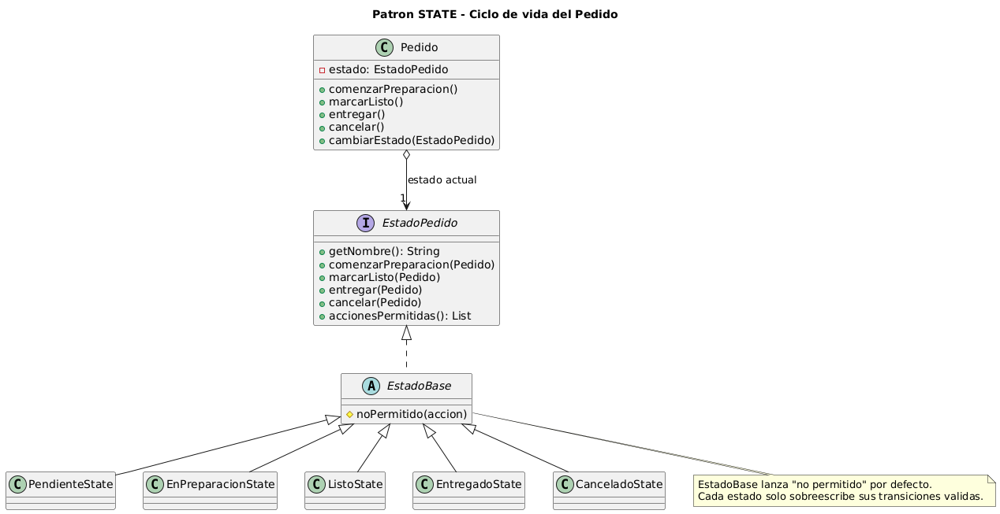

Máquina de estados resultante:

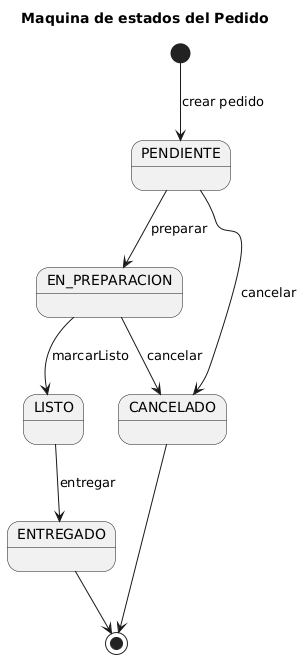

**Participantes.**

| Participante | Rol GOF | Responsabilidad |
|---|---|---|
| `Pedido` | Context | Delega las operaciones en su estado actual; expone `cambiarEstado()` |
| `EstadoPedido` | State | Interfaz de las transiciones y `accionesPermitidas()` |
| `EstadoBase` | — | Implementa todas como "no permitido" (default) |
| `PendienteState`, `EnPreparacionState`, `ListoState`, `EntregadoState`, `CanceladoState` | ConcreteState | Sobreescriben solo sus transiciones válidas |

**Colaboración.** El barista pide "preparar"; el `Pedido` delega en su estado y este dispara la transición:

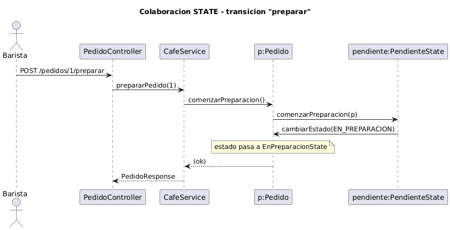

### 6.3 Patrón Strategy

**Nombre.** Strategy (patrón de comportamiento, GOF).

**Propósito.** Definir una familia de algoritmos, encapsular cada uno y hacerlos intercambiables. Strategy permite que el algoritmo varíe independientemente de los clientes que lo usan.

**Motivación.** Las promociones cambian (estudiante, happy hour, canje de puntos) y conviene poder sumar nuevas sin modificar el cálculo del pedido. Cada política de descuento se encapsula como una estrategia intercambiable que se elige en tiempo de ejecución según lo que selecciona el cliente.

**Estructura.**

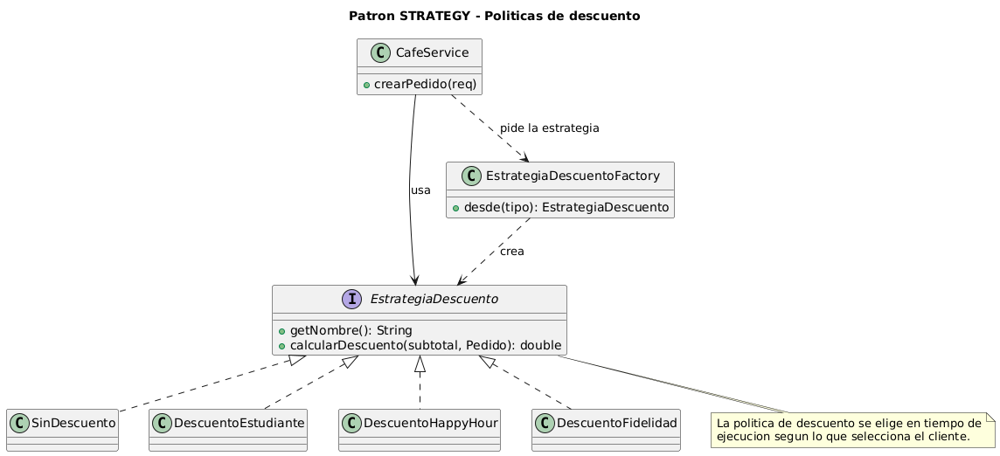

**Participantes.**

| Participante | Rol GOF | Responsabilidad |
|---|---|---|
| `EstrategiaDescuento` | Strategy | Interfaz `calcularDescuento(subtotal, pedido)` |
| `SinDescuento` (Null Object), `DescuentoEstudiante`, `DescuentoHappyHour`, `DescuentoFidelidad` | ConcreteStrategy | Cada política implementa su cálculo |
| `CafeService` | Context | Selecciona y ejecuta la estrategia al crear el pedido |
| `EstrategiaDescuentoFactory` | Auxiliar | Resuelve la estrategia concreta desde el id de la UI |

**Colaboración.** Al confirmar el pedido se elige la estrategia y se aplica sobre el subtotal:

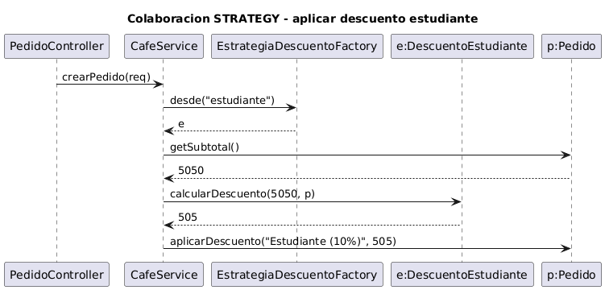

### 6.4 Patrón Observer

**Nombre.** Observer (patrón de comportamiento, GOF).

**Propósito.** Definir una dependencia uno-a-muchos entre objetos, de modo que cuando uno cambia de estado todos sus dependientes son notificados y actualizados automáticamente.

**Motivación.** Cada cambio de estado de un pedido le interesa a varios componentes: el tablero de cocina, el aviso al cliente y el panel de estadísticas. Acoplar el `Pedido` a cada uno sería rígido. Con Observer, el `Pedido` (Subject) solo conoce la interfaz `ObservadorPedido` y notifica a todos; se pueden agregar o quitar observadores sin tocarlo.

**Estructura.**

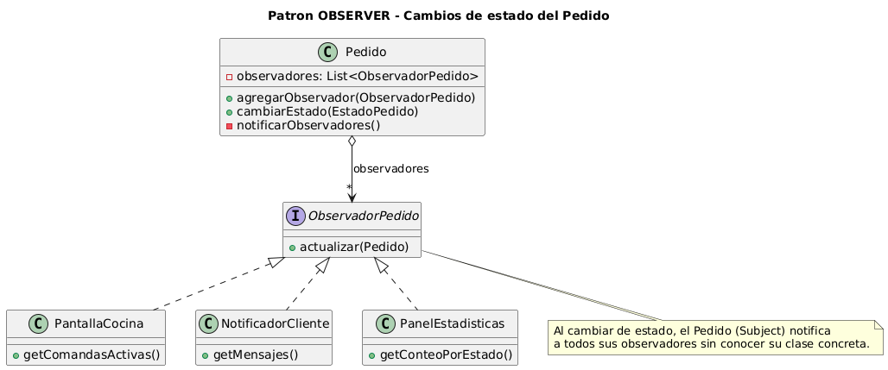

**Participantes.**

| Participante | Rol GOF | Responsabilidad |
|---|---|---|
| `Pedido` | Subject | Mantiene la lista de observadores y los notifica al cambiar de estado |
| `ObservadorPedido` | Observer | Interfaz `actualizar(pedido)` |
| `PantallaCocina` | ConcreteObserver | Mantiene las comandas activas del tablero |
| `NotificadorCliente` | ConcreteObserver | Genera los avisos para el cliente |
| `PanelEstadisticas` | ConcreteObserver | Acumula conteos y facturación |

**Colaboración.** Una sola transición de estado dispara la notificación a los tres observadores:

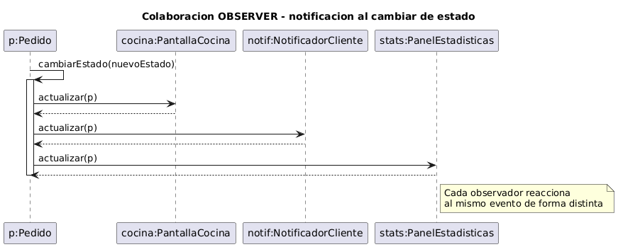

---

## 7. Diseño de la interfaz (DCU / UX / HCI)

### 7.1 Prototipado rápido (wireframes)

Antes de programar la UI se diseñaron wireframes de baja fidelidad de las pantallas clave, aplicando Diseño Centrado en el Usuario.

**Mostrador (cliente):**

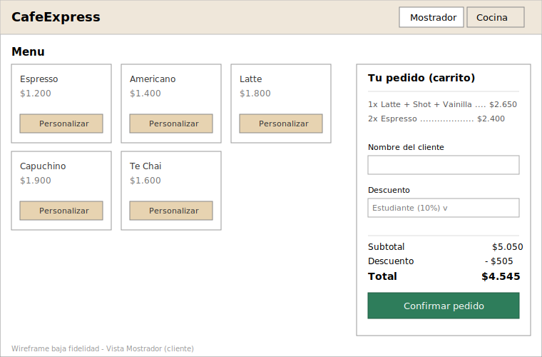

**Modal de personalización (Decorator a la vista del usuario):**

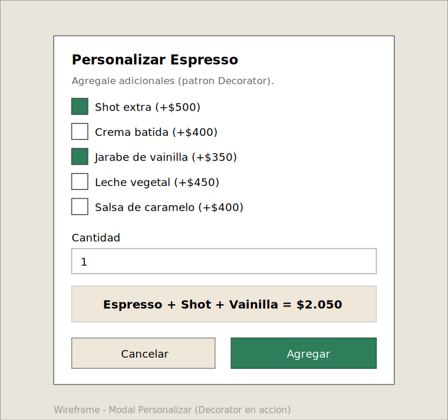

**Cocina (KDS) con panel de Observer:**

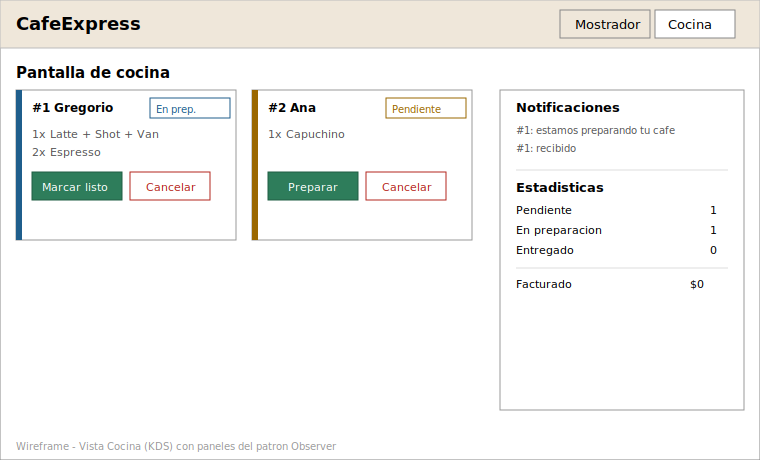

### 7.2 Defensa de la interfaz (UX / HCI)

**Factor humano.** La interfaz reduce la carga cognitiva: el total se recalcula y se muestra siempre, el estado de cada pedido se ve de un vistazo (color + ícono + texto), y las acciones disponibles cambian según el estado para no abrumar.

**Metáforas de la vida cotidiana.** Se usan metáforas reconocibles: el **carrito de compras** para el pedido en curso, el **menú/pizarra** de la cafetería para el catálogo y la **comanda** (ticket) de cocina como en un local real. El usuario no necesita aprender conceptos nuevos.

**Diseño inclusivo (accesibilidad).** 
- Contraste de color acorde a WCAG AA y **foco visible** para navegación por teclado.
- El estado **nunca se comunica solo por color**: siempre se acompaña con ícono y texto (apto para daltonismo).
- Áreas táctiles de al menos 44 px, etiquetas (`label`) asociadas a cada control y región `aria-live` para los avisos (lectores de pantalla).
- Respeto por `prefers-reduced-motion`.

**Prevención de errores (consistencia y feedback — Nielsen).** El backend informa, vía el patrón State, las `accionesPermitidas` de cada pedido; el frontend habilita solo esos botones. Así una transición inválida es **imposible de iniciar** desde la UI, y si igual ocurre, el servidor responde con un mensaje claro (HTTP 409). Las acciones destructivas (cancelar) piden confirmación. Cada acción da feedback inmediato (toast).

**Nuevos paradigmas.** El tablero de cocina se actualiza solo (polling) reflejando los cambios que disparan los observadores, acercándose a una interfaz reactiva en tiempo real. La arquitectura deja la puerta abierta a notificaciones push o asistentes por voz para el barista.

### 7.3 Capturas de la aplicación funcionando

Mostrador con el menú y el carrito:

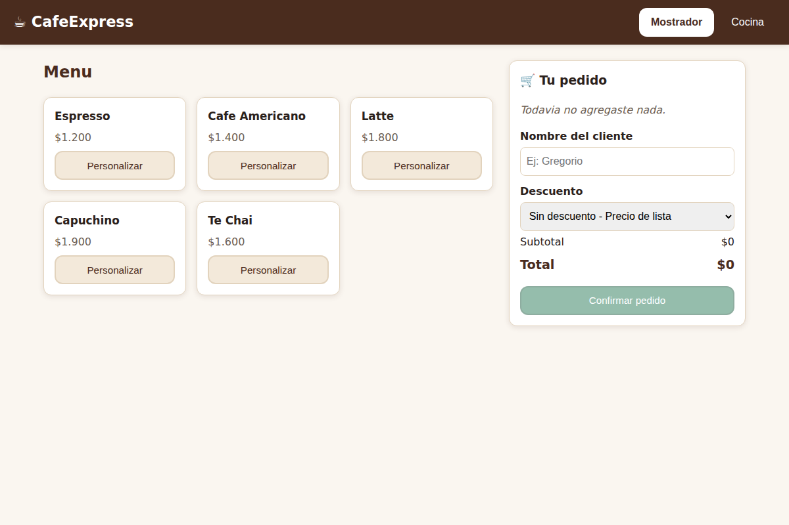

Modal de personalización (Decorator): el precio se compone en vivo:

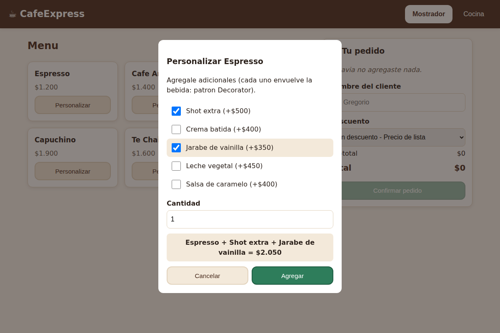

Cocina: ticket con descripción decorada, botones según el estado y paneles de Observer:

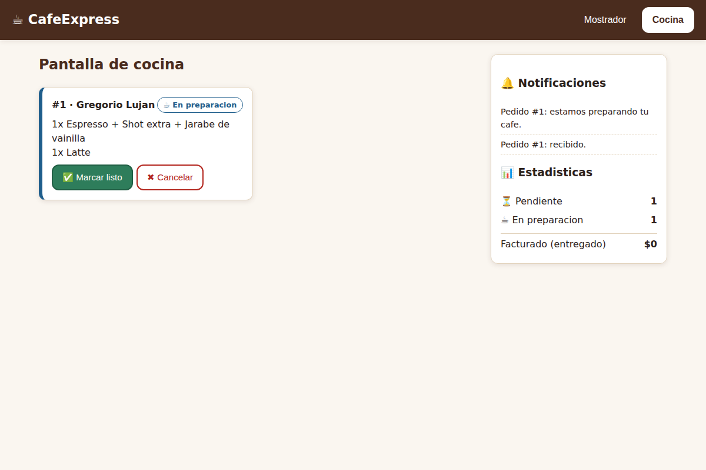

---

## 8. Implementación

### 8.1 Stack tecnológico

- **Backend:** Java 17, Spring Boot 3.3, Maven. Almacenamiento en memoria (alcance de complejidad media).
- **Frontend:** HTML + CSS + JavaScript con **Vue 3** (vía CDN, sin paso de build).
- **Modelado:** UML con PlantUML. **Wireframes:** formato vectorial (estilo Excalidraw/draw.io).

### 8.2 Estructura de paquetes (backend)

```
ar.edu.uch.tpfinal.cafe
├── bebida/        (DECORATOR)  Bebida, BebidaBase + bases, AdicionalDecorator + adicionales
├── pedido/
│   ├── estado/    (STATE)      EstadoPedido, EstadoBase, *State, Estados
│   ├── observer/  (OBSERVER)   ObservadorPedido, PantallaCocina, NotificadorCliente, PanelEstadisticas
│   ├── Pedido           (Context de State + Subject de Observer)
│   └── ItemPedido, PedidoRepository
├── descuento/     (STRATEGY)   EstrategiaDescuento, *Descuento, EstrategiaDescuentoFactory
├── service/                    CafeService (orquesta los 4 patrones), MenuService
└── web/                        Controllers REST + DTOs + manejo de errores
```

### 8.3 API REST

| Método | Endpoint | Descripción |
|---|---|---|
| GET | `/api/menu` | Catálogo de bebidas, adicionales y descuentos |
| POST | `/api/pedidos` | Crea un pedido (Decorator + Strategy) |
| GET | `/api/pedidos` | Lista de pedidos |
| POST | `/api/pedidos/{id}/preparar` | Transición de estado (State) |
| POST | `/api/pedidos/{id}/listo` | Transición de estado (State) |
| POST | `/api/pedidos/{id}/entregar` | Transición de estado (State) |
| POST | `/api/pedidos/{id}/cancelar` | Transición de estado (State) |
| GET | `/api/cocina` | Comandas activas (Observer: PantallaCocina) |
| GET | `/api/notificaciones` | Avisos (Observer: NotificadorCliente) |
| GET | `/api/estadisticas` | Métricas (Observer: PanelEstadisticas) |

### 8.4 Cómo ejecutar

**Backend:**

```bash
cd cafe-pedidos-backend
mvn spring-boot:run        # o: mvn clean package && java -jar target/cafe-pedidos-backend-1.0.0.jar
# Queda en http://localhost:8080
```

**Frontend:**

```bash
cd cafe-pedidos-frontend
python3 -m http.server 5500     # o la extensión Live Server de VS Code
# Abrir http://localhost:5500/index.html
```

## 9. Casos de prueba

El backend incluye pruebas automáticas (`PatronesTest`) que validan los cuatro patrones; el flujo completo se verificó además contra la API real:

| # | Caso | Entrada | Resultado obtenido |
|---|---|---|---|
| 1 | **Decorator** acumula costo | Latte (1800) + Shot (500) + Vainilla (350) | Costo = **$2.650**, "Latte + Shot extra + Jarabe de vainilla" |
| 2 | **Strategy** descuento estudiante | Subtotal $5.050, política "estudiante" | Descuento **$505**, total **$4.545** |
| 3 | **State** transición inválida | Entregar un pedido *Pendiente* | **HTTP 409** "No se puede entregar un pedido en estado PENDIENTE" |
| 4 | **State** flujo feliz | preparar → listo → entregar | Estado final **ENTREGADO** |
| 5 | **Observer** difusión | Cambios de estado del pedido | Cocina, notificaciones y estadísticas actualizadas; al entregar, sale del tablero |

## 10. Conclusión

El trabajo integra los cuatro patrones GOF en un único dominio coherente, donde cada uno resuelve un problema real y distinto: Decorator compone bebidas sin explosión de clases, State ordena el ciclo de vida del pedido, Strategy hace intercambiables las promociones y Observer difunde los cambios a múltiples interesados. Sobre esa base sólida, el frontend aplica Diseño Centrado en el Usuario —metáforas cotidianas, accesibilidad y prevención de errores guiada por el propio modelo de estados— para entregar una solución full-stack eficiente y fácil de usar, tal como pedía el objetivo del integrador.
